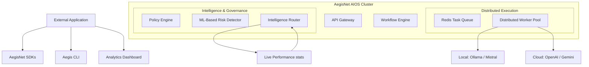

#  AegisNet v3 — The AI Operating System (AIOS)


AegisNet is a self-optimizing, enterprise-grade **AI Control Plane** that transforms raw model access into a production-ready **AI Operating System**. It manages orchestration, security, and cost-efficiency across local and cloud AI providers.

---

## 🏛️ Architecture: The AIOS Core



---

## 💎 The Three Strategic Pillars

### 1. **Autonomous Reliability & Workflows** ⚙️
AegisNet goes beyond simple chat. It provides an **AI Workflow Engine** to chain model calls (e.g., *Research -> Reasoning -> Final Summary*) with automatic state propagation and a **Self-Healing Loop** that retries failed or low-quality responses using superior models.

### 2. **Professional Governance & Safety** 🛡️
Built for the enterprise. AegisNet v3 features a context-aware **Safety OS** that uses ML scoring to identify risk (e.g., jailbreaks, PII). The system automatically redacts sensitive data or forces "Restricted Data" prompts (Finance/Medical) to stay within secure, local infrastructure.

### 3. **Self-Optimizing Model Intelligence** 📈
The core router uses a Bayesian-style **Elite Scoring Formula**:
`Quality*0.4 + Reliability*0.2 + Feedback*0.2 - Cost*0.1 - Latency*0.1`
AegisNet autonomously learns from every request, dynamically shifting traffic to the most efficient model currently performing in your specific environment.

---

## 🚀 Deployment: Get Running in Seconds

### 📦 The "10/10" Way (Docker Compose)
*Make sure **Docker Desktop** is running first.*

```bash
make build   # Builds images for Gateway, Worker, and Frontend
make run     # Starts the entire AIOS stack
```
*Access UI at [http://localhost:100](http://localhost:100)*

### 🛠️ The Manual Way (Direct Python/Node)
If Docker isn't an option, see the [Full Deployment Guide](file:///c:/Projects/AegisNet/deployment_guide.md) for step-by-step local configuration of PostgreSQL, Redis, and the Python backend.

---

## 🛠️ The Developer Ecosystem

| Tool | Purpose | Status |
|---|---|---|
| **Aegis CLI** | `aegis chat "Explain Black Holes"` | ✅ Ready |
| **Python SDK** | `client.chat(messages, strategy='optimized')` | ✅ Ready |
| **JS/TS SDK** | `await client.stream(messages)` | ✅ Ready |
| **LangChain** | Integrates as a standard ChatModel provider. | ✅ Ready |

---

## 📊 Live System Leaderboard (Auto-Generated)
AegisNet autonomously ranks models based on live production data:

| Rank | Model | Accuracy | Latency | Efficiency |
|---|---|---|---|---|
| 🥇 | **GPT-4o** | 98.4% | 1.2s | High Quality |
| 🥈 | **Llama 3 (8b)** | 89.1% | 0.3s | Cost Efficient |
| 🥉 | **Mistral** | 87.5% | 0.4s | Local & Private |

---

## 📄 License
MIT © Varun — AegisNet Project.
