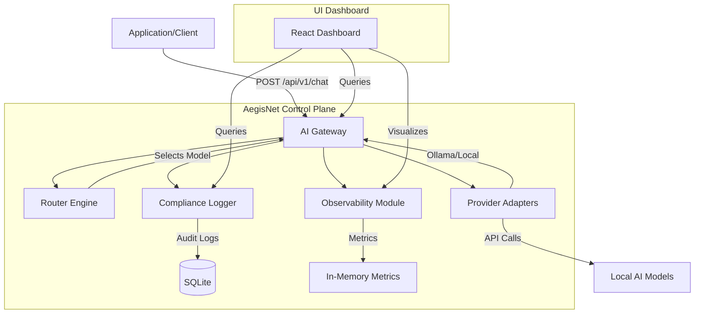

# AegisNet Project Report

## 1. Executive Summary
**AegisNet** is a universal AI control plane designed to sit between applications and local AI models (such as Ollama, LMStudio, etc.). It provides a single, unified API to manage model routing, cost optimization, performance monitoring, and compliance logging. By abstracting the complexity of multiple local providers, AegisNet ensures reliability through failover mechanisms and provides full visibility into AI usage through a real-time analytics dashboard.

---

## 2. System Architecture

AegisNet follows a modern decoupled architecture with a FastAPI backend and a React (Vite) frontend.

### Key Components:
- **Frontend**: A React-based dashboard featuring real-time analytics, an interactive playground, and comprehensive audit logs.
- **Backend (API)**: Built with FastAPI, it orchestrates the request lifecycle.
- **Router Engine**: Implements logic to select the best model based on user-defined strategies.
- **Adapters**: Pluggable modules that translate AegisNet's internal schema to specific provider APIs (currently supports local providers).
- **Compliance & Observability**: Modules dedicated to ensuring every request is logged for audit and every metric is tracked for performance analysis.

---

## 3. How It Works: Request Lifecycle

When a client sends a chat request to `/api/v1/chat`, the following sequence occurs:

1.  **Routing**: The `Gateway` invokes the `Router Engine`. Based on the `routing_strategy` (e.g., `auto`, `quality`), the engine selects the most appropriate provider/model combination.
2.  **Adapter Selection**: The `Gateway` retrieves the corresponding `Adapter` for the selected provider.
3.  **Execution**: The `Adapter` performs the actual API call to the local AI engine.
4.  **Observability**: Immediately after the call, the `Observability` module records the latency, token usage, and cost (if applicable) in memory.
5.  **Compliance**: The `Compliance` module asynchronously writes a full audit trail (including prompts and responses) to the SQLite database.
6.  **Failover**: If the primary model fails, the `Gateway` automatically attempts to route the request to a failover model as defined in the `FAILOVER_CHAIN`.
7.  **Response**: The client receives the AI's response along with detailed metadata about the selected model and execution metrics.

---

## 4. Smart Routing Strategies

AegisNet supports dynamic routing to optimize for different needs:

| Strategy | Description | Selection Logic |
| :--- | :--- | :--- |
| **Auto** | Balanced Routing | Estimates task complexity. Uses high-quality models for complex tasks and fast models for simple ones. |
| **Performance** | Speed Priority | Selects models with the lowest estimated latency. |
| **Quality** | Intelligence Priority | Selects models with the highest internal quality scores. |
| **Cost Optimized** | Budget Priority | Selects the cheapest available model (currently all local models are free). |

---

## 5. Reliability & Compliance

### Automatic Failover
If a model request fails (e.g., provider is offline), AegisNet doesn't just return an error. It iterates through a pre-defined failover sequence, attempting to fulfill the request with alternative models until successful or all options are exhausted.

### Compliance Logging
Every request is captured for audit purposes. The system logs:
- User Identity
- Full Prompt & Response text
- Provider & Model used
- Latency & Token consumption
- Success/Failure Status

---

## 6. Tech Stack
- **Backend**: Python 3.10+, FastAPI, SQLAlchemy, Uvicorn.
- **Frontend**: React 18, Vite, Recharts (for analytics), Tailwind CSS (for styling).
- **Database**: SQLite (local persistence for logs).
- **Deployment**: Docker & Docker Compose.

---

## 8. Technical Deep Dive: Component Breakdown

### Backend Core (`/backend`)
- **`main.py`**: The application's entry point. It initializes the FastAPI app, configures CORS, and registers all API routers. It also handles the database initialization during the application's startup lifespan.
- **`gateway.py`**: The orchestrator. It manages the chat request flow, handles model failover logic, and ensures that metrics and compliance logs are captured for every request.
- **`router_engine.py`**: The decision-maker. It implements smart routing logic (Auto, Performance, Quality, Cost) and uses task complexity estimation to select the best model.
- **`models.py`**: Defines the data layer using SQLAlchemy. It contains schemas for `RequestLog` (audit trail) and `ModelConfig` (provider settings).
- **`schemas.py`**: Contains Pydantic models for strict request and response validation across all endpoints.
- **`database.py`**: Handles the asynchronous connection to the SQLite database.
- **`observability.py`**: A thread-safe metrics collector that maintains real-time aggregates in memory for the analytics dashboard.
- **`compliance.py`**: Simple logger that writes finished request metadata to the database for long-term auditing.

### Provider Adapters (`/backend/adapters`)
- **`base.py`**: Defines the `BaseAdapter` interface that all providers must implement (chat, health_check, cost estimation).
- **`local_adapter.py`**: A concrete implementation for **Ollama**. it translates internal chat requests into Ollama's API format and parses token usage data.

### Frontend Dashboard (`/frontend`)
- **`Dashboard.jsx`**: The main landing page showing high-level status and shortcuts.
- **`Analytics.jsx`**: Uses **Recharts** to visualize latency trends, token usage, and cost distributions.
- **`Logs.jsx`**: A searchable table of all historical AI requests retrieved from the compliance database.
- **`Playground.jsx`**: An interactive chat interface to test different models and routing strategies in real-time.
- **`Models.jsx`**: Displays the status and configuration of all registered AI providers.

---

## 9. Data Schema: What We Capture

### Audit Logs (`RequestLog`)
Every request records:
- **Identity**: `user_id`, `timestamp`.
- **Routing**: `provider`, `model`, `routing_strategy`.
- **Payload**: `prompt`, `response`.
- **Usage**: `input_tokens`, `output_tokens`, `total_tokens`, `cost_usd`.
- **Performance**: `latency_ms`.
- **Status**: `status` (success/error), `error_message`.

---

## 10. Summary Checklist: "How It Works"
- [x] **Unified API**: One endpoint for all models.
- [x] **Smart Routing**: Task-based model selection.
- [x] **Failover**: Automatic retries on provider failure.
- [x] **Audit Trail**: Full compliance logging to SQLite.
- [x] **Analytics**: In-memory real-time metrics.
- [x] **Extensible**: Add new providers by creating an Adapter.
